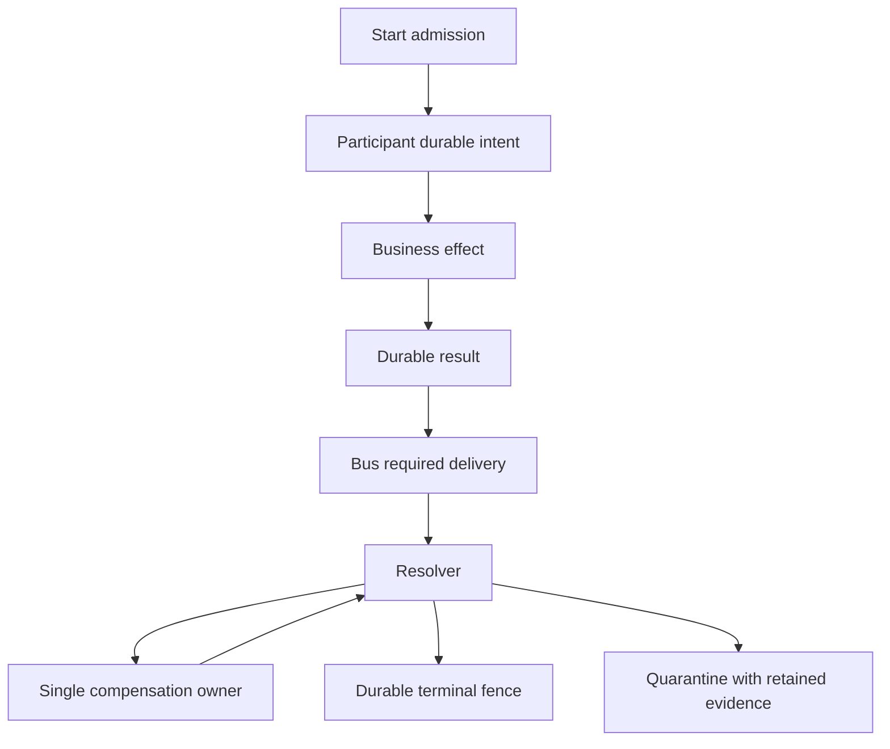
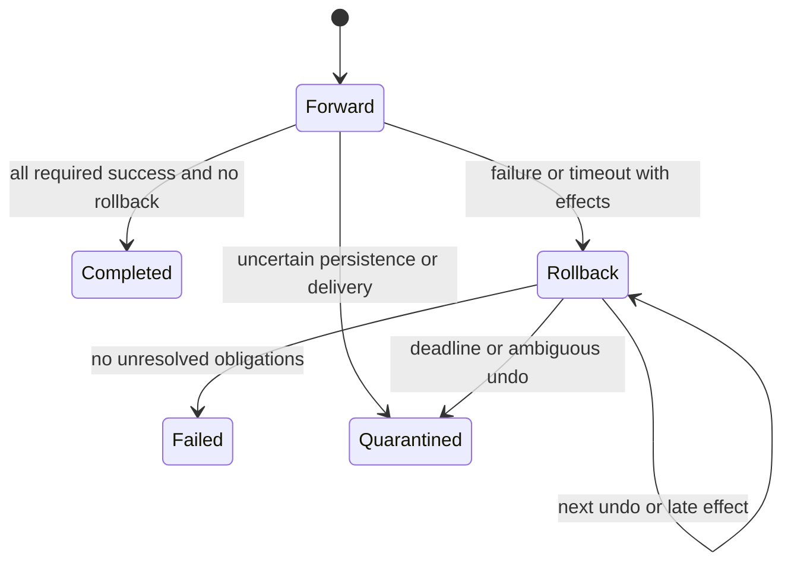
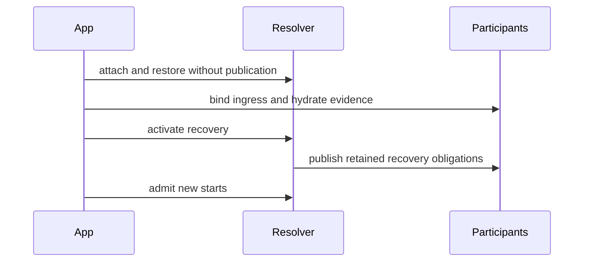
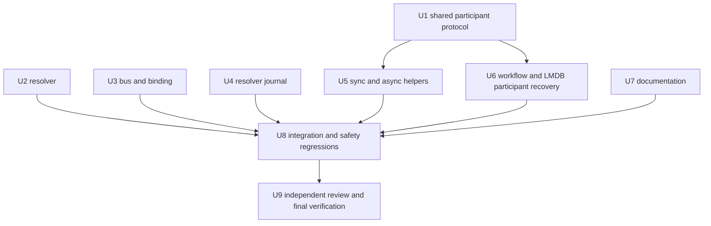

# Production Saga Safety - Plan

## Goal Capsule

- **Objective:** Applications do not repeat terminal business effects after restart, report success without durable evidence, or lose unresolved rollback obligations.
- **Means:** Harden participant persistence, resolver transitions, and bus admission; prove the previously observed failures with safety regressions (KTD1-KTD7).
- **Authority:** User request to fix all QA findings, active repository instructions, Product Contract, then Planning Contract.
- **Execution profile:** Isolated, exclusively scoped writers; rolling dependency layers with at most six concurrent writers. The parent owns integration, authoritative verification, and commits.
- **Stop conditions:** Preserve work and report an execution-infrastructure failure, an incompatible persisted-data change, or unresolved verification failure. Never substitute a different execution protocol silently.
- **Tail ownership:** Parent performs one serial independent non-Luna review after integration. No push, PR, deployment, or merge to the default branch is authorized.

---

## Product Contract

### Summary

Repair all eight reproduced production blockers and the reported conditional/P2 findings.
Retain compatibility where safe, and document safety-related behavioral tightening.

### Problem Frame

The audited baseline is `583cd830fda8b4518a7aa7a6a6d7e8f654079a1f`, equal to freshly fetched `origin/main` on 2026-10-02.
Its normal tests pass, but thirteen additional observation probes reproduce unsafe persistence, replay, rollback, delivery, and startup behavior.
Passing observation probes establish defects; they are not remediation acceptance tests.

### Requirements

**Persistence and replay**

- R1. LMDB participant and resolver records decode from explicitly aligned storage, with archive validation retained.
- R2. A failed durable execution-intent write prevents the business effect, and a failed result write cannot publish success.
- R3. Terminal execution identities remain fenced after restart and memory-cache eviction; a later valid run can reuse an ordinarily resolved saga ID without admitting old events.
- R4. Quarantine retains state, accepted metadata, journal, and dedupe evidence until an operator explicitly resolves or archives it.
- R5. Dedupe storage failures are distinguishable from duplicates and produce visible fail-closed behavior on sync, async, and workflow ingress.

**Rollback, delivery, and startup**

- R6. Rollback is absorbing for forward success; late effects join the remaining rollback obligations or force evidence-preserving quarantine.
- R7. Forward overall/stalled timeouts initiate rollback when effects exist; expiry during unresolved rollback quarantines instead of reporting ordinary failure.
- R8. Required-delivery and actor-forwarding failures never manufacture an ordinary terminal failure that bypasses unresolved effects.
- R9. Recovered watchdog output and new start admission respect the attach, bind, then activate boundary.
- R10. The resolver issues compensation sequentially in reverse completion order and waits for authoritative resolution before advancing.

**API and operations**

- R11. `CompletedWithEffect` has an explicit dispatch contract and must not silently discard its effect identifier.
- R12. Terminal resolver caches are bounded; resolver journals expose configurable capacity and safe compaction that preserves unresolved history and replay fences.
- R13. External-operation crash windows have a documented stable idempotency/reconciliation contract without an exactly-once claim.
- R14. Every behavior-bearing repair has pre-change failure/characterization evidence and passing integrated safety regressions.

### Key Flows

- F1. **Forward execution:** admit a run, persist intent, execute, persist the result, then publish the outcome. Covers R2, R3, R5, R11.
- F2. **Rollback:** stop forward success, request one undo, await authoritative completion, incorporate late effects, then resolve or quarantine. Covers R6-R8, R10.
- F3. **Restart:** restore evidence and fences, bind participant ingress, activate recovery, then permit timeout output and new starts. Covers R1, R3, R4, R9.

### Scope Boundaries

All findings in the production QA are in scope.
Linux/Windows runtime certification, real external-service integration, production load certification, and a current advisory-database audit are not established by this change.
This work does not add a deployment or publish an upstream PR.

---

## Planning Contract

### Key Technical Decisions

- KTD1. **Use validated aligned copies at archive boundaries.** LMDB byte-slice alignment is not an archive guarantee (R1).
- KTD2. **Use durable run records and terminal tombstones.** Execution identity includes saga ID, saga type, and `saga_started_at_millis`; process-local latches are caches, not authority (R3, R4).
- KTD3. **Centralize strict admission and terminal retention in `SagaStateExt`.** Participant variants consume one shared protocol instead of inventing divergent replay behavior (R2-R5).
- KTD4. **Keep the existing choreography event vocabulary where possible.** Required delivery failure uses resolver-owned rollback or quarantine; ordinary `SagaFailed` is not a delivery-error shortcut (R6-R9).
- KTD5. **Emit singleton compensation requests.** The resolver owns the remaining reverse-order queue and advances only after completion, including accepted compensation (R6, R7, R10).
- KTD6. **Use explicit effect-dispatch hooks with a fail-closed default.** No new external message-routing dependency is introduced (R11, R13).
- KTD7. **Compact obsolete terminal detail, never implicit replay fences.** Capacity is configurable and compaction is an explicit maintenance operation with transactional failure behavior (R3, R12).

### Assumptions

These are conservative implementation defaults, not new deployment permissions.
Quarantined saga IDs cannot be automatically reused while evidence is unresolved.
A later non-quarantined run must have a strictly later run-start timestamp.
Unsupported effect dispatch quarantines rather than silently treating the effect as emitted.
Archive enum additions are appended without changing existing variant layout; legacy journals remain readable, and uncertain legacy executions fail closed.

### High-Level Technical Design

### Concurrency and Ownership

The shared participant contract is a prerequisite only for participant consumers.
Resolver, bus, and resolver-journal work can proceed while that contract is implemented.
The parent integrates the shared contract before starting helpers and workflow writers.
Documentation can proceed from the settled behavior contract and is reconciled against actual exported APIs at integration.
Every writer uses its own worktree and Cargo target directory.
No concurrent writer edits the same file, index, build output, LMDB environment, or test fixture.
No worker sweeps formatting across the repository.

### Risks and Compatibility

- Terminal retention changes tests that assumed automatic deletion; update those tests to enforce R3/R4, not to hide missing evidence.
- The shared protocol must compile before downstream lanes launch. Capture its public-interface names in the worker packets after integration.
- Do not discard historical tombstones merely to bound memory or disk. R12 bounds caches and supports maintenance; permanent replay safety has an irreducible durable identity cost.
- No library journal can atomically commit a remote service's effect. R13 makes that application obligation explicit.
- Restore must distinguish terminal records, quarantined evidence, and a newer run; folding all historical runs together would violate R3.
- Failed persistence after a business effect may prevent durable quarantine as well. Keep the original intent, in-memory compensation evidence, and a visible reconciliation signal; do not claim successful durability.

---

## Implementation Units

### U1. Establish durable participant admission and terminal retention

- **Goal:** Provide the shared run-fencing, strict-storage, terminal-retention, and dispatch-hook contract.
- **Requirements:** R2-R5, R11, R13; KTD2, KTD3, KTD6.
- **Dependencies:** None.
- **Files:** `src/events.rs`, `src/state_ext.rs`, `src/support.rs`, `src/traits.rs`, `src/errors.rs`, `src/journal.rs`, `src/dedupe.rs`, `src/lib.rs`, `src/state.rs`, `tests/support/faults.rs`, `tests/qa_remediation_state.rs`. Minimal exhaustive-match compatibility edits in `src/durability.rs` are permitted before U6 starts.
- **Approach:** Add shared admission and terminal-record helpers, retain replay authority in journals, and supply default effect-dispatch hooks. Preserve existing strict helper signatures. Make a committed, compiling protocol before dependent writers start.
- **Execution note:** Start with failing restart/replay and failed-storage tests. Characterize legacy recovery before introducing appended archive variants.
- **Patterns to follow:** `check_dedupe_strict`, `record_event_strict`, embedded `SagaParticipantSupport`, and fault-injected journal tests.
- **Test scenarios:** Same terminal run after reconstructed support is rejected; a later ordinary run is admitted; stale events and quarantined reuse are rejected; journal reads/writes fail closed; existing archive variants remain readable; run histories remain separated.
- **Verification:** Shared contract tests pass and all-feature library compilation succeeds; record exact downstream method names in the handoff.

### U2. Make rollback complete, absorbing, and ordered

- **Goal:** Preserve all undo obligations across late completions and timeout paths.
- **Requirements:** R3, R6, R7, R10, R12; KTD4, KTD5.
- **Dependencies:** None.
- **Files:** `src/resolver.rs`, `tests/qa_remediation_resolver.rs`.
- **Approach:** Give the rollback phase an ordered queue and a single active owner. Handle late effects, repeated failure, and timeout transitions. Scope terminal caches to execution identities and enforce their configured limit.
- **Execution note:** Replace bug-confirming expectations with safety assertions before changing production transitions.
- **Patterns to follow:** Existing accepted-compensation deadline/quarantine handling and deterministic `ingest_at` tests.
- **Test scenarios:** AnyOf cannot complete during rollback; late AllOf effects are undone or quarantined; both generic timeout modes compensate known effects and quarantine pending rollback; undo order is reverse completion order; duplicates do not advance the queue; accepted undo blocks its successor; later runs and stale-run events are isolated; cache overflow is bounded.
- **Verification:** Resolver safety tests and existing resolver tests pass with documented intentional expectation changes.

### U3. Fence bus admission and recovery delivery

- **Goal:** Keep delivery shortfalls and startup timing inside the recovery safety boundary.
- **Requirements:** R3, R8, R9, R12; KTD2, KTD4.
- **Dependencies:** None; integration reconciles with U2.
- **Files:** `src/bus.rs`, `src/binding.rs`, `tests/qa_remediation_bus.rs`.
- **Approach:** Gate watchdog publication and new starts until recovery activation. Consult durable run history before replay fanout. Route required-delivery and forwarding failures to rollback ownership or evidence-preserving quarantine, including compensation delivery failures. Avoid unbounded bus-side terminal caches.
- **Execution note:** Start with recovered-deadline-before-activation and partial-delivery regressions.
- **Patterns to follow:** Existing strict publication, resolver attachment, recovery activation, and actor binding tests.
- **Test scenarios:** Deadline expiry before activation emits nothing; activation delivers pending obligations once; pre-activation start fails admission; same terminal run is rejected before fanout across bus restart; later run succeeds; required subscriber and actor-forwarding failures do not emit ordinary failure over effects; failed compensation delivery retains reconciliation evidence; resolver journal read failure blocks admission.
- **Verification:** Bus/binding tests and real actor integration regressions pass.

### U4. Repair resolver archive decoding and maintenance

- **Goal:** Make resolver persistence restart-safe and maintainable under sustained use.
- **Requirements:** R1, R3, R12; KTD1, KTD7.
- **Dependencies:** None.
- **Files:** `src/resolver_journal.rs`, `tests/qa_remediation_resolver_journal.rs`.
- **Approach:** Decode aligned validated copies. Add configurable map capacity and transactional compaction, with a compatible default for custom journal implementations. Keep unresolved events and terminal replay identities.
- **Execution note:** Observe varied-payload read/reopen failure before fixing alignment; establish compaction invariants before implementing deletion.
- **Patterns to follow:** Existing sequence-exhaustion and duplicate-row protection tests.
- **Test scenarios:** Payload lengths zero through seven survive live read and reopen; durable attachment succeeds; corrupted rows remain errors; compaction preserves every unresolved run and terminal fence; sequence numbering remains monotonic; unsupported custom maintenance reports its limitation; small capacity fails visibly without losing old records.
- **Verification:** LMDB journal tests pass in debug and release and compaction preserves the recovery/replay contract.

### U5. Make sync and async execution fail closed

- **Goal:** Apply the shared persistence and replay protocol to both ordinary participant paths.
- **Requirements:** R2-R5, R10, R11; KTD3, KTD5, KTD6.
- **Dependencies:** U1 integrated and committed.
- **Files:** `src/helpers.rs`, `tests/qa_remediation_helpers.rs`.
- **Approach:** Consume U1 admission and terminal helpers. Persist intent before forward and undo effects. Preserve compensation data after result-write failure. Invoke the effect hook before claiming effect success and respect singleton compensation ownership.
- **Execution note:** Reuse the QA fault journal and record separate red evidence for intent-write and completion-write failures.
- **Patterns to follow:** Strict accepted-step/compensation persistence and existing sync/async parity tests.
- **Test scenarios:** Failed start append runs no effect; failed completion append emits no success and retains reconciliation evidence; sync and async dedupe outages are visible; quarantine retains evidence; reopened participant rejects old terminal start; later normal run is allowed; declared effect dispatch succeeds once or fails closed; undo result-write failure cannot claim completion.
- **Verification:** Helper tests and sync/async ingress integration tests pass.

### U6. Harden workflow ingress and participant recovery

- **Goal:** Provide the same guarantees for workflow participants and reopened LMDB storage.
- **Requirements:** R1-R5, R10, R11, R13; KTD1-KTD3, KTD5, KTD6.
- **Dependencies:** U1 integrated and committed.
- **Files:** `src/durability.rs`, `tests/qa_remediation_workflows.rs`, `tests/durability_lmdb_integration.rs`, `tests/durability_in_memory.rs`.
- **Approach:** Consume the shared contract, hydrate current-run state and fences, retain quarantined accepted metadata, repair quarantine validation, and align participant decoding. Keep recovery events and ordinary ingress behavior consistent.
- **Execution note:** Prove reopened LMDB replay safety and workflow storage failure before changing ingress or recovery behavior.
- **Patterns to follow:** Existing accepted-step metadata and authoritative resolution tests.
- **Test scenarios:** Completed/quarantined LMDB runs cannot repeat effects after reopen; retained accepted evidence remains inspectable; new run recovery does not fold old records into it; storage and dedupe outages visibly quarantine; intent failure prevents workflow effect; result failure prevents success; effect hook is honored; malformed archives fail validation; restart does not auto-resolve quarantined work.
- **Verification:** In-memory and LMDB durability suites pass, including recovery round trips and workflow-specific regressions.

### U7. Document the operational safety contract

- **Goal:** Make startup, retention, effect dispatch, and external idempotency obligations actionable.
- **Requirements:** R3, R4, R9-R13.
- **Dependencies:** None; reconcile exact API names after U1-U6.
- **Files:** `README.md`, `docs/architecture.md`, `docs/integration_guide.md`, `docs/operations.md`.
- **Approach:** Update the startup sequence, retention/compaction guidance, single-owner rollback semantics, effect-dispatch migration, and administrative quarantine resolution. State limits without an exactly-once promise.
- **Test expectation:** No independent behavior change; validate examples and API links against the integrated library.
- **Verification:** Documentation describes actual APIs, no automatic quarantine pruning, and no unsupported deployment guarantee.

### U8. Integrate and prove all QA repairs

- **Goal:** Demonstrate the shared safety contract on the integrated tree.
- **Requirements:** R1-R14.
- **Dependencies:** U1-U7.
- **Files:** All owned implementation/test paths for reconciliation; `tests/qa_production_safety.rs`; documentation examples if needed.
- **Approach:** Inspect actual lane diffs and ownership. Integrate in dependency order and convert all thirteen original QA observations into safety expectations or explicitly linked equivalent regressions. Remove obsolete unsafe expectations and temporary approaches, not valid coverage.
- **Execution note:** Retain the original QA worktree unchanged. Capture pre-remediation evidence separately from green final results.
- **Test scenarios:** Full actor/bus/participant restart chain, late rollback ordering, strict delivery failure, pre-activation watchdog, faulty persistence, and aligned real LMDB recovery.
- **Verification:** Every required gate below passes; all thirteen observation scenarios have a safe disposition.

### U9. Review and deliver the verified change set

- **Goal:** Resolve independent review findings and provide reproducible evidence.
- **Requirements:** R14.
- **Dependencies:** U8.
- **Files:** Parent-authorized remediation files only; review and verification artifacts outside the plan body.
- **Approach:** One serial fresh non-Luna reviewer checks correctness and evidence. Parent fixes valid findings, reruns affected and final checks, and commits only intended files. Preserve worktrees and residual limitations.
- **Verification:** No unresolved P0/P1/P2 implementation finding remains; final report names the plan, branch, commits, checks, and untested deployment surfaces. No publication occurs.

---

## Verification Contract

All Cargo work uses the cached dependency set: offline, locked, and two build jobs.
Workers use private target directories; the parent runs authoritative integrated checks.

| Gate | Command | Acceptance |
|---|---|---|
| Default debug | `cargo test --offline --locked -j 2` | All applicable tests pass; existing ignored doctests are identified |
| All-feature debug | `cargo test --offline --locked --all-features -j 2` | All tests and doctests pass |
| All-feature release | `cargo test --offline --locked --release --all-features -j 2` | Optimized LMDB decode/reopen and safety tests pass |
| Default lint | `cargo clippy --offline --locked --all-targets -j 2 -- -D warnings` | No warnings |
| All-feature lint | `cargo clippy --offline --locked --all-features --all-targets -j 2 -- -D warnings` | No warnings |
| Formatting | `cargo fmt --all -- --check` | No diff |
| Rustdoc | `RUSTDOCFLAGS='-D warnings' cargo doc --offline --locked --all-features --no-deps -j 2` | No warnings |
| Diff hygiene | `git diff --check` | No whitespace errors or accidental files |
| Independent review | One completed serial non-Luna review | Findings resolved with parent verification |

---

## Definition of Done

Every U1-U7 handoff names actual changed files, inspected tests, pre-change evidence, command results, and residual risks.
U8 passes the Verification Contract and maps all original QA scenarios to safe behavior.
U9 records a completed independent review and fixes all valid findings.
No abandoned implementation, observation-only bug assertion, or temporary experiment remains in the delivered diff.
No execution progress is written into this plan.
Canonical and QA checkouts remain untouched, and no push or PR is performed.
